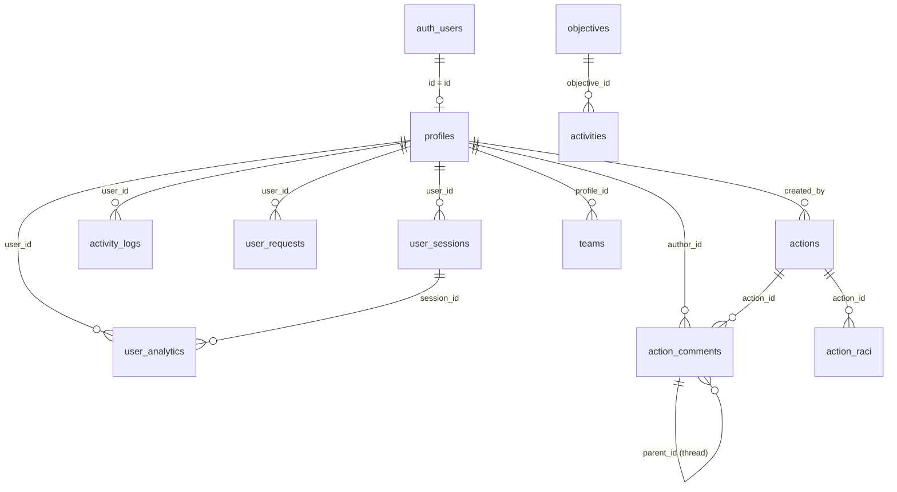
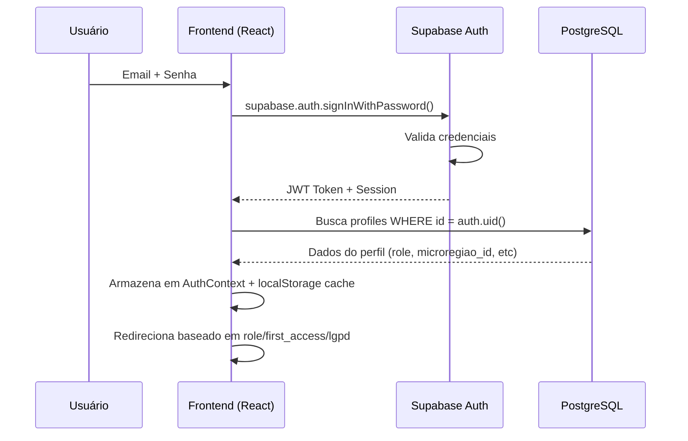

# RADAR Minas Digital 2.0 — Documentação Técnica Completa

> **Documento para Handoff à Fábrica de Software**
> Versão: 1.0 | Data: 27/02/2026 | Classificação: Confidencial

---

## 1. Visão Geral do Projeto

**RADAR NSDIGI** (Radar Minas Digital 2.0) é uma plataforma web de gestão estratégica para a **Secretaria de Estado de Saúde de Minas Gerais (SES-MG)**. Ela permite o planejamento, acompanhamento e monitoramento de ações de transformação digital em saúde, organizadas por **microrregiões** do estado.

### 1.1 Problema que Resolve

A SES-MG precisa coordenar iniciativas de saúde digital em dezenas de microrregiões. O RADAR centraliza esse acompanhamento com:

- Gestão de **7 Eixos Estratégicos** de saúde digital
- Acompanhamento de **Objetivos → Atividades → Ações** por microrregião
- Matriz **RACI** (Responsável, Aprovador, Informado) por ação
- Dashboard analítico com mapas interativos de Minas Gerais
- Painel admin com analytics de uso, ranking, alertas e calendário linear
- Controle de acesso baseado em **4 papéis** (superadmin, admin, gestor, usuario)
- **LGPD compliance** (consentimento obrigatório no primeiro acesso)

### 1.2 URL de Produção

```
https://radar-ses-mg.vercel.app
```

---

## 2. Stack Tecnológica

### 2.1 Frontend

| Tecnologia | Versão | Uso |
|---|---|---|
| React | 18.2 | UI framework |
| TypeScript | 5.2 | Linguagem |
| Vite | 5.0 | Build tool / Dev server |
| Tailwind CSS | 3.3 | Estilização |
| Recharts | 3.6 | Gráficos e dashboards |
| Leaflet | 1.9 | Mapas interativos (MG) |
| Framer Motion | 12.25 | Animações |
| React Router DOM | 6.30 | Navegação SPA |
| date-fns | 4.1 | Manipulação de datas |
| lucide-react | 0.562 | Ícones |
| html2canvas | 1.4 | Exportação de screenshots |
| canvas-confetti | 1.9 | Efeitos visuais |

### 2.2 Backend (BaaS)

| Serviço | Provedor | Uso |
|---|---|---|
| Database | Supabase (PostgreSQL 15) | Banco de dados relacional |
| Auth | Supabase Auth (JWT) | Autenticação e autorização |
| Edge Functions | Supabase (Deno) | Operações admin (CRUD users) |
| Row-Level Security | PostgreSQL RLS | Segurança a nível de linha |
| Realtime | Supabase Realtime | Publicação de mudanças (configurado mas não ativo no client) |

### 2.3 Deploy Atual

| Componente | Plataforma |
|---|---|
| Frontend (SPA) | **Vercel** |
| Backend (BaaS) | **Supabase Cloud** |

### 2.4 Ferramentas de Desenvolvimento

| Ferramenta | Uso |
|---|---|
| ESLint 9 | Linting |
| PostCSS + Autoprefixer | Processamento CSS |
| rollup-plugin-visualizer | Análise de bundle |
| sharp | Geração de thumbnails |
| Supabase CLI | Migrações e dev local |

---

## 3. Estrutura do Projeto

```
radar-2.0/
├── src/                        # Código-fonte frontend
│   ├── App.tsx                 # Componente principal (2106 linhas)
│   ├── index.tsx               # Entry point React
│   ├── index.css               # Estilos globais
│   ├── types.ts                # Tipos do domínio
│   ├── auth/                   # Sistema de autenticação
│   │   ├── AuthContext.tsx      # Provider de auth (491 linhas)
│   │   ├── ProtectedRoute.tsx   # Rotas protegidas
│   │   └── permissions.ts      # Motor de permissões RACI
│   ├── components/             # Componentes reutilizáveis
│   │   ├── common/             # Toast, StatusBadge, FloatingSearch, etc
│   │   ├── layout/             # Header, Sidebar, PageHeader
│   │   ├── mobile/             # Bottom nav, drawer, fab mobile
│   │   ├── modals/             # Modais reutilizáveis
│   │   └── onboarding/         # Tour de primeiro acesso
│   ├── features/               # Features por domínio
│   │   ├── actions/            # CRUD de ações (cards, formulários)
│   │   ├── admin/              # Painel administrativo
│   │   │   ├── AdminPanel.tsx   # Gerenciamento de usuários (79K)
│   │   │   ├── dashboard/      # Sub-dashboards admin
│   │   │   │   ├── AnalyticsDashboard.tsx  # Dashboard analítico
│   │   │   │   ├── MinasMicroMap.tsx       # Mapa de MG interativo
│   │   │   │   ├── LinearCalendar.tsx      # Calendário linear de ações
│   │   │   │   ├── ComparisonEngine.tsx    # Comparador entre períodos
│   │   │   │   └── ...
│   │   │   └── AnnouncementsManagement.tsx # Gestão de comunicados
│   │   ├── dashboard/          # Dashboard principal do usuário
│   │   ├── gantt/              # Gráfico Gantt de ações
│   │   ├── login/              # Tela de login
│   │   ├── news/               # Feed de notícias interno
│   │   ├── settings/           # Configurações do usuário
│   │   └── team/               # Gestão de equipes
│   ├── hooks/                  # Custom hooks
│   │   ├── useAppData.ts       # Carregamento de dados principal
│   │   ├── useAnalytics.tsx    # Tracking de analytics
│   │   ├── useActionHandlers.ts# Handlers de CRUD de ações
│   │   └── ...
│   ├── services/               # Camada de serviços (acesso ao Supabase)
│   │   ├── authService.ts      # CRUD de usuários (763 linhas)
│   │   ├── dataService.ts      # CRUD de ações/equipes/comentários (2158 linhas)
│   │   ├── analyticsService.ts # Analytics de uso (621 linhas)
│   │   ├── loggingService.ts   # Registro de logs de atividade
│   │   └── requestsService.ts  # Solicitações de usuários
│   ├── lib/                    # Bibliotecas utilitárias
│   │   ├── supabase.ts         # Client Supabase configurado
│   │   ├── eixosConfig.ts      # Configuração dos 7 Eixos Estratégicos
│   │   ├── sessionCache.ts     # Cache de sessão em memória
│   │   ├── mapLoader.ts        # Singleton de carregamento de mapa
│   │   ├── motion.ts           # Configurações de animação
│   │   └── ...
│   ├── data/                   # Dados estáticos
│   │   ├── microregioes.ts     # Dados das microrregiões de MG
│   │   ├── municipios.ts       # Dados dos municípios (~50K)
│   │   ├── analysts.ts         # Lista de analistas
│   │   ├── mockData.ts         # Modo demo offline
│   │   └── mapamg/             # GeoJSON do mapa de MG
│   ├── types/                  # Definições de tipo separadas
│   │   ├── auth.types.ts       # User, UserRole, AuthContext
│   │   ├── analytics.types.ts  # Tipos de analytics
│   │   └── supabase-generated.ts # Tipos gerados do Supabase
│   ├── ui/                     # Componentes UI genéricos
│   │   ├── Button.tsx, Card.tsx, Badge.tsx, Input.tsx, Select.tsx
│   └── contexts/
│       └── ThemeContext.tsx     # Tema claro/escuro
├── database/                   # Scripts SQL
│   ├── schema.sql              # Schema completo do banco (494 linhas)
│   ├── security.sql            # Migração de segurança (337 linhas)
│   ├── setup.sql               # Setup de objectives/activities
│   ├── seed.sql                # Dados iniciais
│   ├── migrations/             # Migrações incrementais
│   └── fixes/                  # Scripts de correção
├── supabase/                   # Configuração Supabase CLI
│   ├── config.toml             # Config do projeto Supabase
│   └── migrations/             # 20 migrações versionadas
├── supabase-functions/         # Edge Functions (Deno)
│   ├── create-user/index.ts    # Criação de usuário (320 linhas)
│   ├── delete-user/index.ts    # Exclusão de usuário (200 linhas)
│   └── update-user-password/   # Atualização de senha
├── scripts/                    # Scripts utilitários
│   ├── sync-profiles.ts        # Sincronização de perfis
│   ├── diagnose-orphans.ts     # Diagnóstico de usuários órfãos
│   ├── generate-map-layers.mjs # Geração de camadas do mapa
│   └── verification_report.sql # Report de verificação SQL
├── docs/                       # Documentação existente
│   ├── SUPABASE.md             # Doc do banco de dados
│   ├── DEPLOY-EDGE-FUNCTIONS.md# Guia de deploy de Edge Functions
│   └── security-test-checklist.md # Checklist de segurança
├── public/                     # Assets estáticos (26 itens)
├── package.json                # Dependências NPM
├── vite.config.ts              # Config do Vite + code splitting
├── tailwind.config.js          # Config do Tailwind
├── tsconfig.json               # Config TypeScript (strict mode)
└── app.yaml                    # Descritor de deploy
```

---

## 4. Modelo de Dados (PostgreSQL)

### 4.1 Diagrama de Entidades



### 4.2 Tabelas Detalhadas

#### `profiles` — Usuários do sistema
| Coluna | Tipo | Descrição |
|---|---|---|
| `id` | UUID PK | Mesmo ID do `auth.users` |
| `nome` | TEXT | Nome completo |
| `email` | TEXT | Email (login) |
| `role` | TEXT | `superadmin` / `admin` / `gestor` / `usuario` |
| `microregiao_id` | TEXT | FK → microrregiões (NULL = acesso global) |
| `ativo` | BOOLEAN | Se o usuário está ativo |
| `lgpd_consentimento` | BOOLEAN | Aceitou LGPD |
| `lgpd_consentimento_data` | TIMESTAMPTZ | Data do aceite |
| `avatar_id` | TEXT | ID do avatar (zg1-zg16) |
| `municipio` | TEXT | Município do usuário |
| `first_access` | BOOLEAN | Precisa completar onboarding |
| `created_by` | UUID FK | Quem criou o usuário |
| `created_at` / `updated_at` | TIMESTAMPTZ | Timestamps |

#### `actions` — Ações estratégicas
| Coluna | Tipo | Descrição |
|---|---|---|
| `id` | UUID PK | ID interno |
| `uid` | TEXT UNIQUE | Chave global: `{microregiao_id}::{action_id}` |
| `action_id` | TEXT | ID hierárquico: `1.1.1` |
| `activity_id` | TEXT | Atividade pai: `1.1` |
| `microregiao_id` | TEXT | Microrregião (ex: `MR009`) |
| `title` | TEXT | Título da ação |
| `status` | TEXT | `Concluído` / `Em Andamento` / `Não Iniciado` / `Atrasado` |
| `start_date` / `planned_end_date` / `end_date` | DATE | Datas |
| `progress` | INTEGER | 0-100 |
| `notes` | TEXT | Observações |
| `created_by` | UUID FK | Criador |

#### `action_raci` — Matriz RACI por ação
| Coluna | Tipo | Descrição |
|---|---|---|
| `id` | UUID PK | ID |
| `action_id` | UUID FK CASCADE | Ação |
| `member_name` | TEXT | Nome do membro |
| `role` | TEXT | `R` (Responsible) / `A` (Accountable) / `C` (Consulted) / `I` (Informed) |

#### `action_comments` — Comentários (threads)
| Coluna | Tipo | Descrição |
|---|---|---|
| `id` | UUID PK | ID |
| `action_id` | UUID FK CASCADE | Ação |
| `author_id` | UUID FK | Autor |
| `parent_id` | UUID FK SELF CASCADE | Resposta a outro comentário |
| `content` | TEXT | Conteúdo |

#### `teams` — Equipes por microrregião
| Coluna | Tipo | Descrição |
|---|---|---|
| `id` | UUID PK | ID |
| `microregiao_id` | TEXT | Microrregião |
| `name` | TEXT | Nome |
| `cargo` | TEXT | Cargo/função |
| `email` | TEXT | Email |
| `municipio` | TEXT | Município |
| `profile_id` | UUID FK | Perfil vinculado (se cadastrado) |

#### `user_requests` — Solicitações de usuários
Tipos: `profile_change`, `mention`, `system`. Status: `pending`, `resolved`, `rejected`.

#### `activity_logs` — Logs de atividade (IMUTÁVEIS)
Tipos de entidade: `auth`, `action`, `user`, `view`. **UPDATE/DELETE bloqueados por RLS.**

#### `user_sessions` / `user_analytics` — Analytics de uso
Tracking de sessões, page views, cliques, scroll depth, tempo em página.

#### `objectives` — Objetivos estratégicos
ID serial, título, status (`on-track`/`delayed`).

#### `activities` — Atividades vinculadas a objetivos
ID textual hierárquico (`1.1`, `2.3`), FK para `objectives`.

#### `microregioes` — Microrregiões de MG
ID (`MR001`-`MR077`), código, nome, macrorregião, URS.

---

## 5. Segurança e Autenticação

### 5.1 Fluxo de Autenticação



### 5.2 Hierarquia de Papéis (Roles)

| Role | Permissões |
|---|---|
| **`superadmin`** | Tudo. Não pode ser desativado, deletado ou ter senha alterada por outros |
| **`admin`** | CRUD de usuários, ver todas as microrregiões, painel admin, analytics |
| **`gestor`** | Criar/editar/deletar ações na sua microrregião, gerenciar equipe |
| **`usuario`** | Visualizar ações da sua microrregião. Editar/deletar se tiver papel RACI adequado |

### 5.3 Row-Level Security (RLS)

Todas as tabelas públicas têm RLS habilitado. Regras principais:

- **profiles**: Usuários veem apenas seu próprio perfil; admins veem todos
- **actions**: Admins acesso total; gestores/usuários apenas da sua microrregião
- **action_raci / action_comments**: Acesso baseado na ação pai
- **teams**: Todos logados podem ver; admins/gestores podem editar
- **activity_logs**: **IMUTÁVEIS** — UPDATE/DELETE bloqueados; admins veem todos
- **user_requests**: Usuários veem/criam apenas as suas; admins resolvem todas

### 5.4 Funções Helper SQL

| Função | Descrição |
|---|---|
| `is_admin()` | Retorna TRUE se o usuário é admin ou superadmin |
| `is_superadmin()` | Retorna TRUE se é superadmin |
| `is_admin_or_superadmin()` | Alias com REVOKE de acesso a anon |
| `get_user_microregiao()` | Retorna o microregiao_id do usuário autenticado |
| `handle_new_user()` | Trigger: cria perfil automaticamente ao cadastrar no auth |

### 5.5 Permissões RACI no Frontend

```
R (Responsible)  → visualizar ✅ | editar ✅ | criar ✅ | excluir ❌
A (Accountable)  → visualizar ✅ | editar ✅ | criar ✅ | excluir ✅
I (Informed)     → visualizar ✅ | editar ❌ | criar ❌ | excluir ❌
```

---

## 6. Edge Functions (Serverless — Deno)

As Edge Functions usam o `SUPABASE_SERVICE_ROLE_KEY` para operações admin.

### 6.1 `create-user`
- **Método**: POST
- **Acesso**: Apenas admin/superadmin
- **Validações**: Email válido, senha ≥ 6 chars, role válido, sanitização de inputs
- **Fluxo**: Cria em `auth.users` → Insere em `profiles` (com retry) → Rollback se falhar → Log de auditoria
- **CORS**: Dinâmico via `ALLOWED_ORIGIN` (padrão: `radar-ses-mg.vercel.app`)

### 6.2 `update-user-password`
- **Método**: POST
- **Acesso**: Apenas admin/superadmin
- **Proteção**: Não permite alterar senha do superadmin por terceiros

### 6.3 `delete-user`
- **Método**: POST
- **Acesso**: Apenas superadmin
- **Proteção**: Não permite auto-exclusão ou exclusão de outro superadmin
- **Fluxo**: Exclui profile → Exclui do auth → Log de auditoria

---

## 7. Variáveis de Ambiente

### 7.1 Frontend (Vite — prefixo `VITE_`)

| Variável | Descrição |
|---|---|
| `VITE_SUPABASE_URL` | URL do projeto Supabase (ex: `https://xxx.supabase.co`) |
| `VITE_SUPABASE_ANON_KEY` | Chave anônima do Supabase |
| `VITE_API_TIMEOUT` | Timeout de API em ms (default: 30000) |

### 7.2 Edge Functions (Deno — automáticas no Supabase)

| Variável | Descrição |
|---|---|
| `SUPABASE_URL` | Auto-injetado pelo Supabase |
| `SUPABASE_SERVICE_ROLE_KEY` | Auto-injetado (chave privilegiada) |
| `ALLOWED_ORIGIN` | Origens CORS permitidas (vírgula-separadas) |

---

## 8. Domínio de Negócio

### 8.1 Os 7 Eixos Estratégicos

| # | Eixo | Cor |
|---|---|---|
| 1 | Gestão e Governança em Saúde Digital | 🔴 Rose |
| 2 | Formação e Desenvolvimento | 🔵 Blue |
| 3 | Sistemas e Plataformas de Interoperabilidade | 🔴 Rose |
| 4 | Telessaúde | 🟢 Emerald |
| 5 | Infoestrutura | 🔴 Rose |
| 6 | Monitoramento, Avaliação e Disseminação | 🔴 Rose |
| 7 | Infraestrutura e Segurança | 🔴 Rose |

### 8.2 Hierarquia de Planejamento

```
Eixo (7 pré-definidos)
  └── Objetivo Estratégico (ex: "1. Infoestrutura e Governança")
       └── Atividade (ex: "1.1 Diagnóstico e Mapeamento")
            └── Ação (ex: "1.1.1" — única por microrregião)
                 ├── Status: Não Iniciado / Em Andamento / Concluído / Atrasado
                 ├── Progresso: 0-100%
                 ├── Datas: Início / Prevista / Real
                 ├── RACI: Responsáveis com papéis
                 └── Comentários: Threads tipo Reddit
```

### 8.3 Microrregiões

- O sistema suporta **77 microrregiões** de Minas Gerais (MR001 a MR077)
- Cada microrregião pertence a uma macrorregião e URS
- Ações são **únicas por microrregião** — identificadas por UID: `MR009::1.1.1`
- Admins acessam todas; gestores/usuários apenas a sua

---

## 9. Funcionalidades Principais

| Feature | Descrição | Componentes-chave |
|---|---|---|
| **Login/Auth** | Login por email/senha, aceite LGPD, onboarding de primeiro acesso | `LoginForm`, `AuthContext`, `ProtectedRoute` |
| **Dashboard** | Visão geral de ações por microrregião | `Dashboard`, painel de KPIs |
| **Ações CRUD** | Criar, editar, excluir ações com RACI e comentários | `ActionCard`, `ActionForm`, `dataService` |
| **Gantt Chart** | Visualização temporal de ações | `GanttChart` (lazy loaded) |
| **Mapa de MG** | Mapa interativo com dados por microrregião | `MinasMicroMap` (Leaflet, 70K) |
| **Admin Panel** | CRUD de usuários, analytics, alertas, ranking | `AdminPanel` (79K), dashboards |
| **Analytics** | Sessions, page views, engajamento por região | `AnalyticsDashboard`, `analyticsService` |
| **Comunicados** | Mural de avisos com expiração | `AnnouncementsManagement` |
| **Calendário** | Calendário linear de ações | `LinearCalendar` |
| **Equipes** | Gerenciamento de membros por microrregião | `TeamPanel` |
| **Configurações** | Perfil, avatar, tema, senha | `UserSettingsModal` |
| **Modo Demo** | Acesso offline com dados mock | `mockData.ts`, `loginAsDemo` |
| **Mobile** | Bottom nav, drawer, fab responsivo | `MobileBottomNav`, `MobileDrawer` |

---

## 10. Guia de Migração para Azure

### 10.1 Mapeamento de Serviços: Supabase → Azure

| Componente Atual (Supabase) | Equivalente Azure | Observações |
|---|---|---|
| Supabase Database (PostgreSQL 15) | **Azure Database for PostgreSQL — Flexible Server** | Mesmo motor, migração direta |
| Supabase Auth (JWT) | **Azure AD B2C** ou **Microsoft Entra ID** | Requer reescrita do auth layer |
| Supabase Edge Functions (Deno) | **Azure Functions** (Node.js/TypeScript) | Reescrita de Deno → Node.js |
| Supabase RLS | **PostgreSQL RLS no Azure** | As policies migram junto com o schema |
| Supabase Realtime | **Azure SignalR Service** | Não está ativamente usado no client |
| Supabase Storage | **Azure Blob Storage** | Não usado atualmente |
| Vercel (Frontend) | **Azure Static Web Apps** ou **Azure App Service** | Build estático do Vite |

### 10.2 Plano de Migração Detalhado

#### Fase 1: Infraestrutura (2-3 semanas)

1. **Provisionar Azure Database for PostgreSQL — Flexible Server**
   - SKU recomendado: `Standard_D2ds_v4` (2 vCores, 8GB RAM) para início
   - Habilitar extensões: `pgcrypto`, `uuid-ossp`
   - Configurar SSL obrigatório, backup automático, PITR

2. **Migrar Schema e Dados**
   - Exportar schema com `pg_dump --schema-only` do Supabase
   - Remover referências a `auth.uid()` e `auth.role()` das RLS policies (estas são funções do GoTrue do Supabase)
   - Adaptar as funções helper (`is_admin()`, `is_superadmin()`) para usar contexto de sessão do Azure
   - Importar dados com `pg_dump --data-only` → `psql` no Azure
   - Executar seed data

3. **Provisionar Azure Static Web Apps**
   - Conectar ao repositório Git
   - Configurar build: `npm run build`, output: `dist/`
   - Configurar variáveis de ambiente

#### Fase 2: Autenticação (3-4 semanas)

> [!CAUTION]
> Esta é a parte mais complexa. O Supabase Auth fornece `auth.uid()` e JWT integrado com RLS. No Azure, é necessário implementar essa integração manualmente.

**Opção A: Azure AD B2C (Recomendado para enterprise)**
- Configurar tenant Azure AD B2C
- Criar user flows (sign-up, sign-in, password reset)
- Configurar custom policies para roles customizadas
- Implementar middleware de validação de token no backend

**Opção B: Auth customizado com Azure Functions**
- Implementar login/registro em Azure Functions
- Usar `jsonwebtoken` para emitir JWTs
- Armazenar tokens em `httpOnly` cookies
- Implementar middleware para validar JWT + extrair roles

**Em ambas as opções, é necessário:**
- Substituir `supabase.auth.signInWithPassword()` por chamada ao novo auth
- Substituir `supabase.auth.getUser()` por decodificação do JWT
- Reescrever `AuthContext.tsx` para usar o novo provider
- Adaptar as RLS policies para usar `current_setting('app.current_user_id')` ou similar

#### Fase 3: Edge Functions → Azure Functions (2-3 semanas)

| Edge Function | Migração |
|---|---|
| `create-user` (320 linhas) | Converter de Deno → Node.js 18+. Lógica de negócio se mantém. |
| `delete-user` (200 linhas) | Idem. Usar SDK do Azure AD B2C ou queries diretas. |
| `update-user-password` (161 linhas) | Idem. Usar API admin do Azure AD ou query direta. |

**Alterações necessárias:**
- Trocar `import { serve } from 'deno.land/...'` → handler HTTP do Azure Functions
- Trocar `createClient(...)` do Supabase → `pg` driver direto (ou Prisma/Drizzle)
- Trocar `supabaseAdmin.auth.admin.*` → Azure AD B2C Management API
- Implementar CORS no Azure Functions

#### Fase 4: Camada de Dados (3-4 semanas)

1. **Criar API intermediária (Azure Functions ou Azure App Service)**
   - O frontend atualmente faz queries diretas ao Supabase via SDK
   - No Azure, usar uma API REST intermediária que faz queries ao PostgreSQL
   - Framework sugerido: **Azure Functions** com Node.js + `pg` pool
   - Alternativa: **Azure App Service** com Express/Fastify

2. **Refatorar `services/` no frontend**
   - `dataService.ts` (2158 linhas): Substituir `supabase.from('actions').select(...)` por `fetch('/api/actions')`
   - `authService.ts` (763 linhas): Usar nova API de auth
   - `analyticsService.ts` (621 linhas): Usar nova API
   - `loggingService.ts`: Usar nova API

3. **Manter RLS no PostgreSQL** (opcional, mas recomendado)
   - Configurar `SET LOCAL "app.current_user_id" = '<uuid>'` no início de cada transação
   - Adaptar as policies para usar `current_setting('app.current_user_id')` ao invés de `auth.uid()`

#### Fase 5: Testes e Go-Live (2-3 semanas)

1. Testes de integração de todas as APIs
2. Testes de autenticação com todos os 4 roles
3. Testes de RLS (verificar que isolamento por microrregião funciona)
4. Teste de performance (comparar com Supabase)
5. Migração gradual (blue-green deploy)
6. DNS cutover

### 10.3 Estimativa de Esforço

| Fase | Duração | Equipe Mínima |
|---|---|---|
| Infraestrutura | 2-3 semanas | 1 DevOps + 1 DBA |
| Autenticação | 3-4 semanas | 2 Fullstack |
| Edge Functions | 2-3 semanas | 1 Backend |
| Camada de Dados | 3-4 semanas | 2 Fullstack |
| Testes e Go-Live | 2-3 semanas | QA + DevOps |
| **Total** | **12-17 semanas** | **3-5 pessoas** |

### 10.4 Custos Estimados Azure (mensal)

| Serviço | SKU | Custo Estimado |
|---|---|---|
| PostgreSQL Flexible Server | Standard_D2ds_v4 | ~$130/mês |
| Azure Static Web Apps | Standard | ~$9/mês |
| Azure Functions | Consumption plan | ~$0-20/mês |
| Azure AD B2C | 50K auth/mês gratuitas | $0 (início) |
| Azure Monitor | Basic | ~$0-10/mês |
| **Total** | | **~$140-170/mês** |

### 10.5 Riscos da Migração

> [!WARNING]
> **Risco Alto**: A substituição do Supabase Auth é a maior complexidade. O `auth.uid()` está embutido em todas as RLS policies (9 tabelas × ~30 policies). Qualquer falha aqui quebra toda a segurança.

> [!IMPORTANT]
> **Risco Médio**: O `dataService.ts` tem 2158 linhas com acoplamento direto ao SDK do Supabase. Cada método precisa ser migrado individualmente.

> [!NOTE]
> **Risco Baixo**: As Edge Functions são simples e independentes. A lógica de negócio se mantém, só muda o runtime.

---

## 11. Como Rodar o Projeto Localmente

### Pré-requisitos
- Node.js 18+
- npm 9+
- Conta Supabase (para backend)

### Setup

```bash
# 1. Clonar o repositório
git clone <repo-url>
cd radar-2.0

# 2. Instalar dependências
npm install

# 3. Configurar variáveis de ambiente
cp .env.example .env
# Editar .env com suas credenciais Supabase:
# VITE_SUPABASE_URL=https://SEU_PROJETO.supabase.co
# VITE_SUPABASE_ANON_KEY=sua_chave_anon

# 4. Rodar em desenvolvimento
npm run dev
# Abre em http://localhost:3000

# 5. Build de produção
npm run build
npm run preview
```

### Setup do Banco de Dados

1. Criar projeto no [Supabase Dashboard](https://supabase.com/dashboard)
2. Executar `database/schema.sql` no SQL Editor
3. Executar `database/security.sql` para reforçar RLS
4. Executar `database/setup.sql` para criar objectives/activities
5. Executar `database/seed.sql` para dados iniciais
6. Deploy das Edge Functions via Supabase CLI:
   ```bash
   npx supabase functions deploy create-user
   npx supabase functions deploy delete-user
   npx supabase functions deploy update-user-password
   ```

---

## 12. Scripts de Manutenção

| Script | Uso |
|---|---|
| `scripts/sync-profiles.ts` | Sincroniza usuários auth.users ↔ profiles (trata órfãos) |
| `scripts/diagnose-orphans.ts` | Diagnostica usuários sem perfil no banco |
| `scripts/generate-map-layers.mjs` | Gera camadas geográficas para o mapa |
| `scripts/generate-thumbnails.js` | Gera thumbnails de imagens |
| `scripts/verification_report.sql` | Relatório de verificação do banco |

---

## 13. Glossário

| Termo | Definição |
|---|---|
| **Microrregião** | Subdivisão administrativa do estado de Minas Gerais (ex: MR009) |
| **Macrorregião** | Agrupamento de microrregiões |
| **URS** | Unidade Regional de Saúde |
| **RACI** | Matriz de responsabilidades: Responsible, Accountable, Consulted, Informed |
| **Eixo** | Um dos 7 eixos estratégicos de saúde digital |
| **Objetivo** | Meta estratégica (pode ter múltiplas atividades) |
| **Atividade** | Sub-meta de um objetivo (pode ter múltiplas ações) |
| **Ação** | Unidade fundamental de trabalho, única por microrregião |
| **UID** | Identificador único de ação: `{microregiao_id}::{action_id}` |
| **LGPD** | Lei Geral de Proteção de Dados (lei brasileira de privacidade) |
| **RLS** | Row-Level Security — segurança a nível de linha no PostgreSQL |
| **Edge Function** | Função serverless executada no edge (Deno runtime no Supabase) |
| **Zé Gotinha** | Mascote do sistema de saúde usado como avatares (zg1-zg16) |
